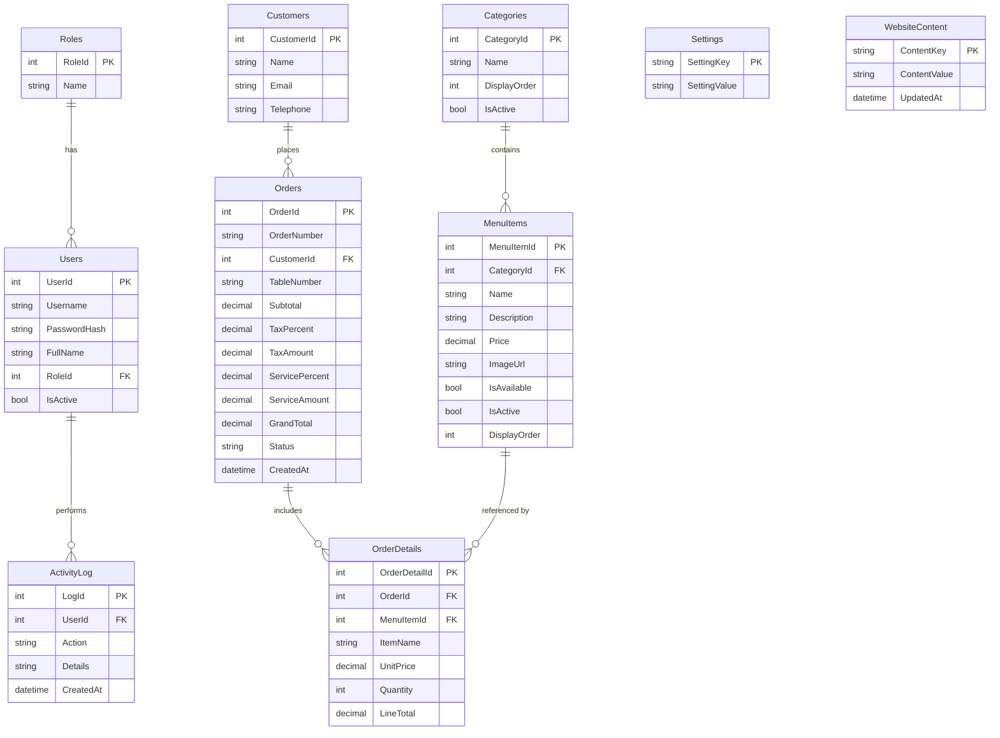

# Entity Relationship Diagram

Notes: Tax and service percentages are stored in `Settings` (keys `tax_percent`, `service_percent`) and are also snapshotted on every order, so historical invoices never change when the rates change. `OrderDetails.ItemName` and `UnitPrice` are snapshots for the same reason.
